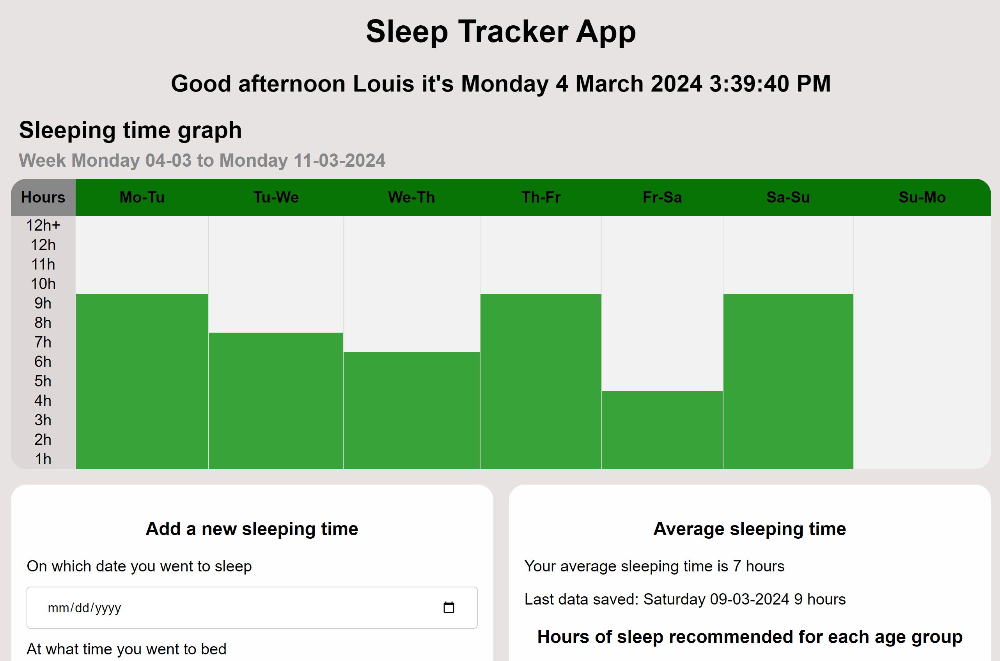

# Sleep-Traker-App

This is a Sleep tracker that tracks your sleeping hours. 
 
I use a custom-made visual graph to tracks sleeping time.

All the use data is saved on the server side using Flask in a csv.

## Prerequisites to run the code

``pip install Flask`` is need to run the sever.

 
## How to run the code:
1. Download the GitHub repository
2. Open the code in VSCode and the integrated terminal
3. Run the app using : ``flask --app server.py run`` (for widows machine)